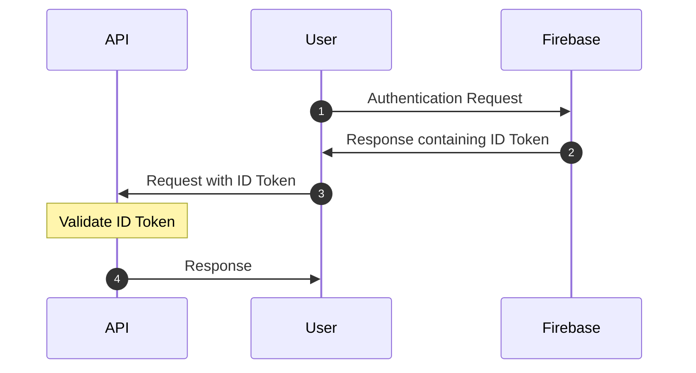

# Authentication

Exyle.io uses Firebase to authenticate the users.

Let's say a user wants to request some data from the API server. First, they
have to retrieve an ID Token from firebase by signing in with their credentials.
This token can then be passed to the API server so it can verify and respond
with corresponding data.

A simple example code using Node.JS and expressJS can be found
[Here](https://fireship.io/snippets/express-middleware-auth-token-firebase).
