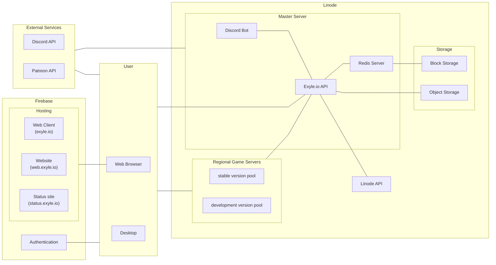

# Online Infrastructure Overview

## Introduction

The Exyle.io online infrastructure is a complex, intertwined collection of
different components that powers the entire game by connecting users with each
other and managing their data. This looks simple enough on the surface, but
there are many technical challenges people are not usually aware of such as
seamlessly scaling the servers depending on the load, protecting the servers
from cyber attacks, managing backups and recovering from one when needed, making
the services crash-tolerant, efficiently organizing all the data, and balancing
everything for the minimum operation cost. And believe or not, that's just the
tip of the iceberg.

In this document, we'll try to unravel this information from a developer's
point of view with the goal of understanding where different component exists
and how they fit with each other.

Below is a simplified diagram of the said system.

## External Services

Although we try to stay as independent as possible in terms of technology, when
it comes to platform, we tend to use things that can be used by the largest
number of people.

[Discord](https://discord.com) is by far the most popular (and arguably the most
powerful) community-building platform in the world. Especially for gamers. Here
in Exyle.io, we use Discord extensively to alleviate the boundary between the
community and the game. Discord provides various tools developers can use to
create epic features such as role syncing, game invites, gaming activity status,
chat bridge, etc. You can find more information in the
[Discord Developer Portal](https://discord.com/developers/docs/intro).

[Patreon](https://patreon.com) is a membership platform used to financially
support Exyle.io. You can find more information in the
[Patreon API Documentations](https://docs.patreon.com)

## Firebase

[Firebase](https://firebase.google.com) is a popular
[Baas (Backend as a Service)](https://www.cloudflare.com/learning/serverless/glossary/backend-as-a-service-baas)
owned by Google. Although they provide many useful features, we're only using it
to host websites and authenticate users. This is to prevent
[Vendor lock-in](https://www.cloudflare.com/learning/cloud/what-is-vendor-lock-in).

## User

Ways to interact with Exyle.io:

- Playing the game
  - via Desktop Client
  - via Web Client
- Visiting a website
  - via Web Browser

## Linode

[Linode](https://linode.com) is a cloud hosting provider that provides one of
the cheapest service without any major compromises.

Related resources:

- [infrastructure Distribution](https://linode.com/global-infrastructure)
- [Pricing](https://linode.com/pricing)

## Regional Game Servers

Game servers are strategically placed across the globe to provide low latency
gaming experience for everyone. They each host one or more game server that are
automatically allocated and de-allocated by the [master server](#master-server).
You can learn how they are distributed in the
[server distribution plan](./server-distribution-plan).

## Master server

Located in Newark, New Jerseys, the master server is the "brain" of Exyle.io
responsible for bringing everything together as a single service.

## Exyle.io API

The Exyle.io API is a HTTP-based interface between the data and the users.
It acts as a middleman that safely reads from and writes to the database so no
one can view or modify it without proper authorization.

It also communicates with the Linode API to instantiate and destroy regional
game servers depending on the load.

## Redis Server

[Redis](https://redis.com) is a in-memory key-value database as opposed to the
more traditional relational table database. It is very extensible thanks to its
[modules](https://redis.io/resources/modules) system, and has many useful modern
features such as [sorted sets](https://redis.io/docs/data-types/sorted-sets)
which makes it easy to rank players based on certain statistics. However, redis
is volatile by default so it requires extra
[configuration](https://github.com/exyleio/exyleio-scripts/tree/master/master-server)
for the data to be [persistent](https://redis.io/docs/manual/persistence).

## Storage

There are two types of storage in Linode:
[Block Storage](https://linode.com/products/block-storage) and
[Object Storage](https://linode.com/products/object-storage).

|             Area | Block Storage  |    Object Storage    |
| ---------------: | :------------: | :------------------: |
| Read/Write speed |      High      |         Low          |
|          Latency |      Low       |         High         |
|     Price per GB |      High      |         Low          |
|        Use cases | Redis Database | Log & Replay storage |
