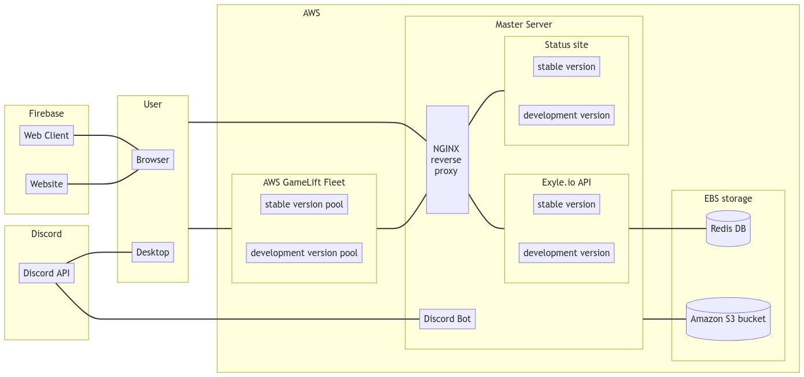

# Infrastructure

## Introduction

The Exyle.io online infrastructure is a complex intertwined
collection of programs and services that powers the entire
game by connecting users with each other and managing their data.
On the surface, this looks simple enough, but there are many technical
challenges people are not usually aware of such as seamlessly scaling
the servers up and down depending on the load, protecting the servers
from hackers, managing backups and recovering from one when needed,
making the services crash-tolerant, efficiently organizing all the user
data, and of course, balancing everything for the minimum operation cost.
And that's just the tip of the iceberg.

In this document, we'll go over the surface level information about
the entire system with the goal of having a better understanding of how
things fit with each other.

Below is a simplified diagram of the said system.



<details>
<summary>Click to see mermaid</summary>

Nah, [this mermaid](https://mermaid-js.github.io) LMAO.

```
flowchart LR
    subgraph firebase[Firebase]
        direction LR
        web-client["Web Client\n(exyle.io)"]
        website["Website\n(web.exyle.io)"]
        status-site["Status site\n(web.exyle.io)"]
    end
    firebase --- browser

    subgraph discord[Discord]
        discord-api[Discord API]
    end
    discord-api --- desktop-client
    discord-api --- discord-bot
    discord-bot --- exyleio-api

    subgraph patreon[Patreon]
        patreon-api[Patreon API]
    end
    patreon-api --- exyleio-api

    subgraph user[User]
        browser[Web Browser]
        desktop-client[Desktop Client]
    end
    user --- nginx-proxy
    user --- aws-gamelift-fleet

    subgraph aws[AWS]
        classDef aws_padding fill:none,stroke:none
        subgraph aws_padding [ ]
            subgraph aws-gamelift-fleet[AWS GameLift Fleet]
                direction LR
                region-servers-stable[stable version pool]
                region-servers-dev[development version pool]
            end
            aws-gamelift-fleet --- nginx-proxy

            subgraph master-server[Master Server]
                discord-bot[Discord Bot]
                nginx-proxy[ \n\n\n NGINX \n reverse \n proxy \n\n\n\n]

                subgraph exyleio-api[Exyle.io API]
                    direction LR
                    api-stable[stable version]
                    api-dev[development version]
                end

                subgraph data[Data]
                    direction LR
                    redis-db[(Redis Database)]
                    long-term-storage[(Long-term Storage)]
                end
            end
            nginx-proxy --- exyleio-api
            exyleio-api --- data
        end
        class aws_padding aws_padding
    end
```

</details>

## Discord

Discord offers numerous tools developers can work with to create epic
features such as role syncing, chat bridge, rich presence, game
invitation etc. Though we try to stay as technologically independent
as possible, we are also constantly looking out for new ways to
maximize community integration.

## Firebase

Whenever we need a website that users can open using their web browser,
we use [Google firebase](https://firebase.google.com). We made this
choice because it is free, reliant, fast, and easy to work with.

## AWS

Once a developer build a program, they need a place to run them.
Of course, it is possible for them to use their computer, but that
comes at the cost of security, stability, and performance. Because
of that, every component of our cloud infrastructure are hosted by
Amazon in their [AWS](https://aws.amazon.com) platform. We
specifically chose this provider mainly because they provide a simple
way to manage game servers
([Amazon GameLift](https://aws.amazon.com/gamelift)), but they also
have the best cost to performance ratio when it comes to the level of
performance we need from our servers. They also happen to be the most
popular cloud service provider in the world, so there are plenty of
learning materials to train future developers.

Related resources:

- [server distribution plan](./server-distribution-plan.md)
- [List of available regions](https://docs.aws.amazon.com/AWSEC2/latest/UserGuide/using-regions-availability-zones.html)
- [EC2 instance types](https://aws.amazon.com/ko/ec2/instance-types)
- [pricing](https://aws.amazon.com/ko/gamelift/pricing)

### Game servers

Game servers use one of the following instance types.
They all have at least 8GB RAM and 2 vCPU.

| Instance Type | vCPU | threads per core\* | RAM (GB) |           CPU model           |                                       benchmark (www.cpubenchmark.net)                                        |
| :-----------: | :--: | :----------------: | :------: | :---------------------------: | :-----------------------------------------------------------------------------------------------------------: |
|   m5.large    |  2   |                    |    8     |     intel 8175M / 8259CL      | [26659](https://www.cpubenchmark.net/cpu.php?id=3311) / [33279](https://www.cpubenchmark.net/cpu.php?id=3671) |
|   m5a.large   |  2   |                    |    8     |         AMD EPYC 7571         |                             [27445](https://www.cpubenchmark.net/cpu.php?id=3543)                             |
|   m4.large    |  2   |                    |    8     | intel E5-2686 v4 / E5-2676 v3 | [16745](https://www.cpubenchmark.net/cpu.php?id=2870) / [13498](https://www.cpubenchmark.net/cpu.php?id=2643) |

\*: [threads per core](https://docs.aws.amazon.com/AWSEC2/latest/UserGuide/cpu-options-supported-instances-values.html)

## Master server

Located in Northern Virginia (us-east-1), the master server is
a t3a.micro EC2 instance responsible for the orchestration of
region-specific game servers, databases, and various external
services.

## Nginx

Since shutting down a server and relaunching an updated version
will result in some downtime, an NGINX reverse proxy is used to
seamlessly switch between different API versions. This also
removes the need to give the server root permission to access
system ports.

## Exyle.io API

The Exyle.io API is a [GraphQL](https://graphql.org)-based interface
between the data and the users. It acts as a middleman that safely
reads from and writes to the database so no one can view or modify
it without authorization. To minimize the effects of cyber attacks,
it is protected by [Cloudflare](https://www.cloudflare.com).

## Redis Database

Database is defined as a collection of data relevant to the operation of
a service. Behind the scene, we use [Redis](https://redis.com) which is a
in-memory key-value store as opposed to the more traditional relational
table database. We made this choice not only because redis has a blazingly
fast read/write speed, but also because it has many useful modern features
such as the ability to easily rank players based on certain statistics which
is made possible thanks to its
[sorted sets](https://redis.io/docs/data-types/sorted-sets) data type.
However, since redis is volatile by default, it requires extra configuration
to have [persistency](https://redis.io/docs/manual/persistence).
In our case, we're only using AOF.

## Long-term storage

It is impractical to store large files that do not get many read/write requests
in the database especially since redis puts all its data in the memory. Because
of that, files such as skin assets, match replay files, and server logs are
stored separately in a special place called the
[object storage](https://aws.amazon.com/s3). It is a slow, but extremely reliant
and cost-effective solution for archiving data for long periods of time. For
comparison, [elastic block storage (EBS)](https://aws.amazon.com/ebs) is
available 99.999% of the time as supposed to 99.999999999% in S3.
