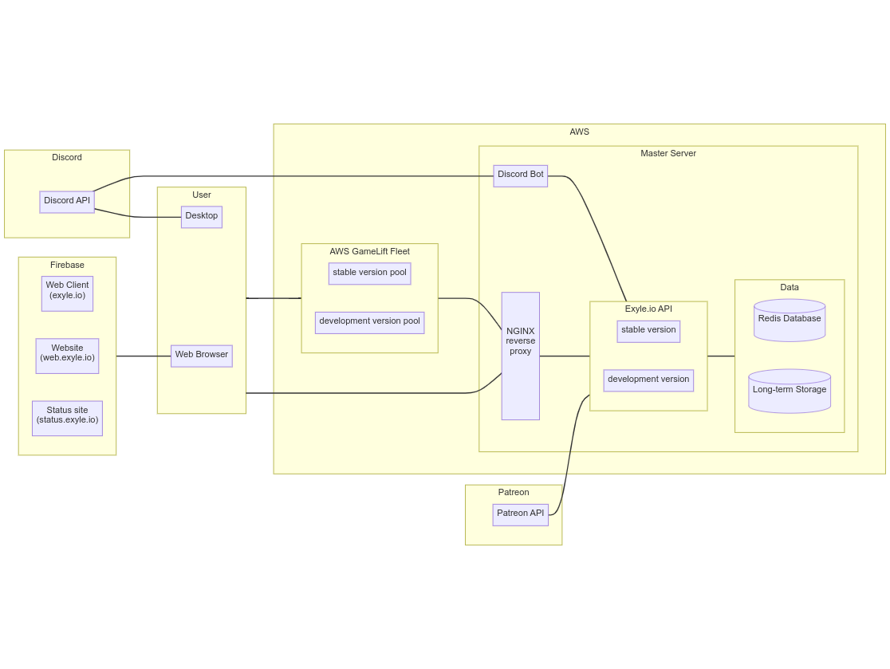

# Infrastructure

## Introduction

The Exyle.io online infrastructure is a complex intertwined
collection of programs and services that powers the entire
game by connecting users with each other and managing their data.
On the surface, this looks simple enough, but there are many technical
challenges people are not usually aware of such as seamlessly scaling
the servers up and down depending on the load, protecting the servers
from hackers, managing backups and recovering from one when needed,
making the services crash-tolerant, efficiently organizing all the user
data, and of course, balancing everything for the minimum operation cost.
And that's just the tip of the iceberg.

In this document, we'll go over the surface level information about
the entire system with the goal of having a better understanding of how
things fit with each other.

Below is a simplified diagram of the said system.



<details>
<summary>Click to see mermaid</summary>

Nah, [this mermaid](https://mermaid-js.github.io) LMAO.

```
flowchart LR
    subgraph firebase[Firebase]
        direction LR
        web-client["Web Client\n(exyle.io)"]
        website["Website\n(web.exyle.io)"]
        status-site["Status site\n(web.exyle.io)"]
    end
    firebase --- browser

    subgraph discord[Discord]
        discord-api[Discord API]
    end
    discord-api --- desktop-client
    discord-api --- discord-bot
    discord-bot --- exyleio-api

    subgraph patreon[Patreon]
        patreon-api[Patreon API]
    end
    patreon-api --- exyleio-api

    subgraph user[User]
        browser[Web Browser]
        desktop-client[Desktop Client]
    end
    user --- nginx-proxy
    user --- aws-gamelift-fleet

    subgraph aws[AWS]
        classDef aws_padding fill:none,stroke:none
        subgraph aws_padding [ ]
            subgraph aws-gamelift-fleet[AWS GameLift Fleet]
                direction LR
                region-servers-stable[stable version pool]
                region-servers-dev[development version pool]
            end
            aws-gamelift-fleet --- nginx-proxy

            subgraph master-server[Master Server]
                discord-bot[Discord Bot]
                nginx-proxy[ \n\n\n NGINX \n reverse \n proxy \n\n\n\n]

                subgraph exyleio-api[Exyle.io API]
                    direction LR
                    api-stable[stable version]
                    api-dev[development version]
                end

                subgraph data[Data]
                    direction LR
                    redis-db[(Redis Database)]
                    long-term-storage[(Long-term Storage)]
                end
            end
            nginx-proxy --- exyleio-api
            exyleio-api --- data
        end
        class aws_padding aws_padding
    end
```

</details>

## Discord

- TODO

## Firebase

- TODO

## User

- TODO

## AWS

- TODO

## GameLift fleet

- TODO

## Master server

- TODO

## Nginx

- TODO

## Exyle.io API

The Exyle.io API is a [GraphQL](https://graphql.org)-based interface
between the data and the users. It acts as a middleman that safely
reads from and writes to the database so no one can view or modify
it without authorization.

## Redis Database

Database is defined as a collection of data relevant to the operation of
a service. Behind the scene, we use [Redis](https://redis.com) which is a
in-memory key-value store as opposed to the more traditional relational
table database. We made this choice not only because redis has a blazingly
fast read/write speed, but also because it has many useful modern features
such as the ability to easily rank players based on certain statistics which
is made possible thanks to its
[sorted sets](https://redis.io/docs/data-types/sorted-sets) data type.
However, since redis is volatile by default, it requires extra configuration
to have [persistency](https://redis.io/docs/manual/persistence).
In our case, we're only using AOF.

## Long-term storage

- TODO
